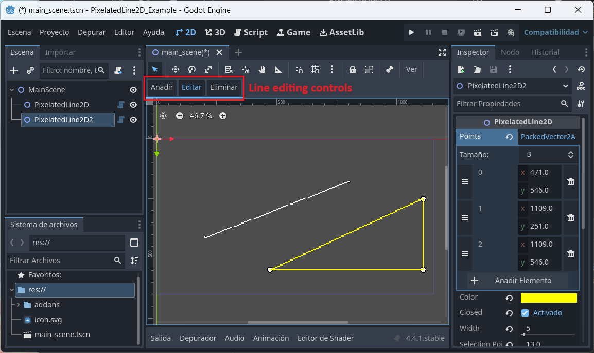

# PixelatedLine2D - Godot Plugin

**PixelatedLine2D** is a plugin for Godot Engine that allows you to draw 2D lines with a pixelated look, ideal for retro or pixel-art styled games.

## Features

- Works similarly to Godot’s built-in `Line2D` node.
- Lines are rendered with sharp, pixel-perfect edges—no smoothing or antialiasing.
- Fully customizable: adjust the width, color, and points of the line.
- Compatible with Godot 4.x.

## Why use PixelatedLine2D?

Godot’s default `Line2D` node uses antialiasing, which can break the pixel-art aesthetic. **PixelatedLine2D** solves this by rendering crisp lines that blend seamlessly with low-resolution, pixel-based visuals.

## Installation

This repository is a complete Godot project with the plugin already installed and configured.

To try it out:

1. Download or clone the repository.
2. Open the project in Godot (4.x).
3. Run the demo scene to see `PixelatedLine2D` in action.

You can copy the `addons/` folder into your own project if you want to use the plugin elsewhere.

## Example usage

```gdscript
var line = PixelatedLine2D.new()
line.points = [Vector2(0, 0), Vector2(64, 32)]
line.width = 1
line.color = Color.WHITE
add_child(line)
```

## Preview



*Example of a pixelated line drawn using `PixelatedLine2D`.*
